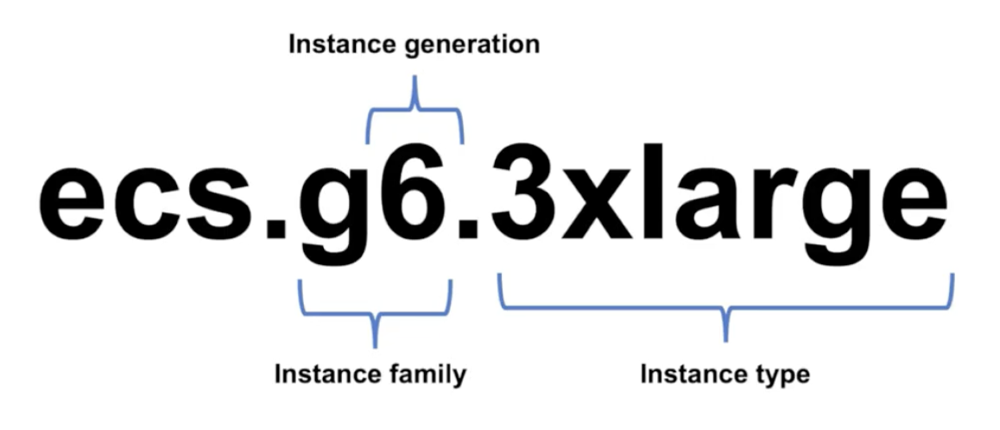
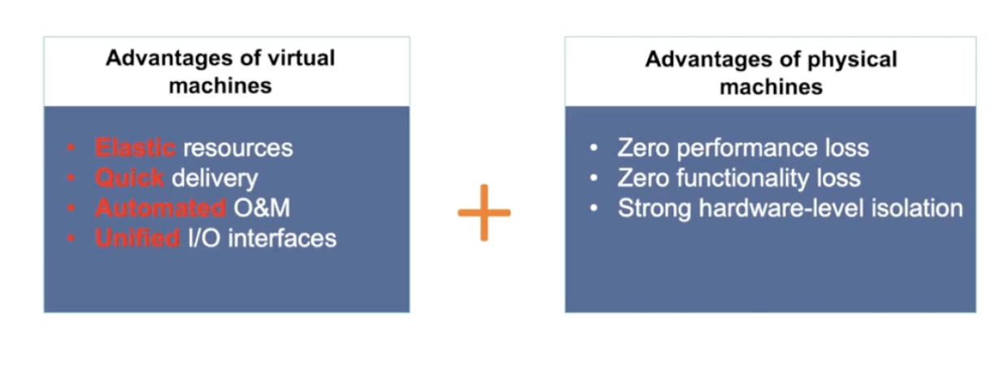
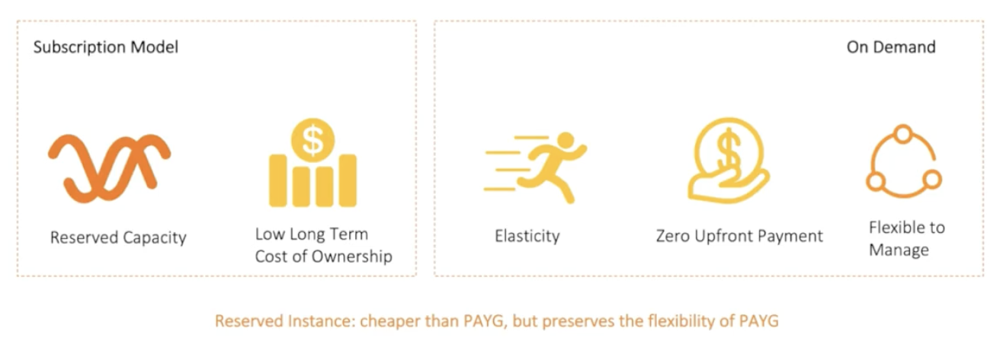
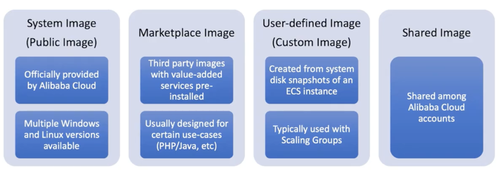
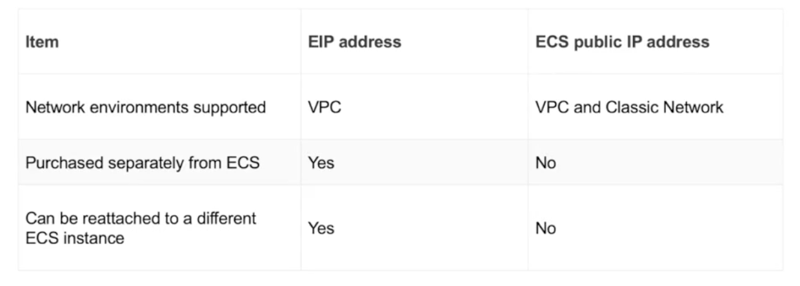

# Elastic Computing Service (ECS)

## Apsara

1.  ECS runs on top of Apsara distributed system

2.  Virtualization based on XEN/KVM

3.  Apsara distributed "Pangu" for storage

## Zones

1. Fault isolation can be performed between zones

2. Region contains multiple zones

3. Distribution policy

   - resources in multiple zones = high availability /high disaster recovery

   - resources in same zone = lower network latency

4. traffic that passes between zones in the same region is free

   - cross region traffic will incur public bandwidth charge

   - VPN gateway charge for VPN tunnel

   - CDN network charge if enterprise multi region private network

## Instances

### Types

1. Burstable type T6

2. General type G6

3. Memory type R6

4. Compute Optimized type C6

### Families

### Bare Metal Instances

1.  Virtual machine + physicaly machine
    

2.  Encrypted computed for high security applications

3.  Revirtualization, run docker directly without virtualization between hardware and docker

4.  Supercomputing

5.  ECI,

    - run containers without servers

6.  Instance Failover

    - Single instance: 99.975%
    - Multi-zone deployment: 99.995%

## Billing model

1. Pay as you go (PAYG)
2. Subscription
3. Preemptible instance
4. Reserved instances, more flexible purchasing model

   

## Storage

### Cloud Disk as system and data disk

1. Based on Apsara's distributed file system, "Pangu"

2. 3 copies stored separately on different physical servers attached to different network switches

3. High data reliability

### 3 types

1. Ultra Disk

2. Standard SSD

3. Enhanced SSD

### Cloud disk independent of ECS instances

1. mounted to any instances in the same zone, no cross-zone or cross region

2. mounted by on 1 instance at a time

3. billed by type and capacity, PAYG & subscription

4. instance -> cloud disk (one to many relationship)

## Disk Snapshots

1. Can be stored in OSS.

2. Manual and Auto (snapshot policies) supported

3. Recommended :

   - routine backup of system & data disks
   - system disk snapshots can be used to create custom images, can be reused to create new ECS instance
   - Data disk snapshot can be used to clone data on disk (testing purpose)

4. Auto Snapshot

   - 100 auto snapshot policies max
   - Avoid snapshots during peak hours, it may impact I/O performance

5. Pricing policy

   - up to 256 manual snapshots
   - up to 1000 automatic snapshots per disk

6. Incremental

   - only changes is stored, it isn't coppying every single time

7. Disk images

   

## VPC (Virtual Private Cloud)

1. Connect ECS instances together, isolated from one another

2. Disconnected from other VPCs unless you explicitly peer VPCs together

3. VRouter (virtual router) - route traffic inside VPC & route traffic to and from internet

4. VSwitch (virtual switch) - represent a subnet

5. Security Group

   - set of stateful firewall rules that apply to ECS inside VPC

   - can have multiple security groups in VPC

   - enable ECS instances to safely talk to other networks, e.g. public internet

   - rules:

     1. Action/Rule type: accept or block traffic

     2. Port range

     3. Protocol (ICMP, TCP, UDP)

     4. Authorization Objects: security group ID or IP address range then rule applies to

   - Key features

     1. Regional concept, can cross zone, but not region

     2. ECS must belong to at least 1 security group

     3. ECS in the same security group can communicate with each other

     4. ECS in different security groups cannot communicate with each other unless the rule allows it

6. Elastic IPs (EIP)

   - attach to ECS to grant them access to public internet

   - ipv4 public internet facing address

   - can move between different instances, even not in the same zone

   - ECS & ECS Disks cannot move between zones, EIP can

7. Communications between VPC and internet

   - Public IP or Elastic IP to ECS instance

   - Configure a NAT gateway, attach it to VPC group, NAT Gateway: maps private IPs to public IPs

   - Server Load Balancer (SLB) to distribute connections to ECS instances in VPC group

8. EIP vs Standard Public IP

   

   - key advantage: flexibility

9. ENI

   - Virtual network interface that can be attached to an ECS instance
