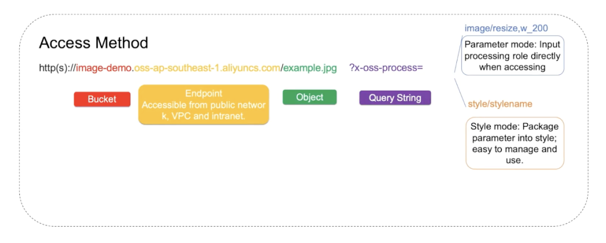

# OSS (Object Storage Service)

## What is OSS?

And encrypted and secure cloud storage service which stores, processes and accesses massive amounts of data from anywhere in the world

### Advantages of OSS

1. **Scalability**: single OSS bucket can hold up to **50 petabytes** of data, **unlimited number of objects**

2. **Simplicity**: restful HTTP API can be accessed from anywhere, anytime

   - flexible object size 0 - 48.8TB
   - flexible upload: Normal/Multipart/Append
   - managed service
   - monitoring, metrics, access log

3. **Security**:

   - Multi-layer protection and anti-DDoS
   - Multi-user isolation
   - Comprehensive logs

4. **Availability**

   - All data stored in 3 physical servers, 99.999999999% data reliability
   - 99.99% service availability
   - Automatic service expansion
   - Automatic failover with cross-region replication

5. **Inclusiveness**

   - Integration with other Alibaba cloud services
   - EMR, MaxCompute, AnalyticDB, DLA
   - EBS snapshot, RDS snapshot, Docker image
   - RAM, STS, CloudMonitor, SLS....

## Core concepts

OSS depends heavily on "Pangu" distributed file system component of Apsara

### Objects

1.  3 parts

    | Attribute | Description                                           |
    | --------- | ----------------------------------------------------- |
    | key       | an unique object name                                 |
    | data      | user data                                             |
    | metadata  | key-value pair that expresses the object's attributes |

2.  Data portion is opaque to OSS

3.  Size of object varies with the upload method

    - Multipart upload supports objects of up to 48.8TB

    - Other upload methods only support objects of up to 5GB

### Buckets

1. Serve as containers for objects

2. Bucket name is **globally unique** and cannot be changed

3. **No limit on the number of objects** in each bucket

4. An application can have 1 or more buckets

5. Organize the OSS namespace at the highest level

6. Access control & Usage reporting

### Keys

1. A key is an object's unique indentifier

2. bucket + key = any unique object

3. URL

   

   - bucket names have to be unique because they are part of resolvable DNS name that points to bucket

4. key properties

   

### Storage Classes

### Lifecycle

1. When should objects transition between storage classes

2. When they should be deleted

3. What patterns an object must match in order for a give lifecycle rule to take effect

### Redundancy & fault tolerance

1. Versioning

2. Cross region replication

   - copy bucket to another bucket in another region automatically

### Back to Origin - Mirroring

### Back to Origin - Redirection

### Logging

Turn on logging for a given bucket, and then store logs into a "destination" bucket

Log entry includes:

1. Source IP
2. Timestamp
3. type of HTTP requests
4. Flags associated with that request
5. OS of requestor

Turn on real time logging feature to index logs and make them searchable

### Image processing

Massive capacity, high security, low costs and high reliability
mage processing service.

1. Upload image to OSS

2. Append a tag to the URL pointing to the image

3. New image is produced & sent when a GET request is made

Features supported:

1. Convert image format
2. Scaling, cropping, rotating
3. Add text or watermarks
4. coloring effects

### Security Features

1. SSL or TLS (HTTPS)

2. Access & Control

   - Bucket and Object level ACL

     - Determines object can be read or written publicly
       - public read
       - public read/write
       - private
     - Determines if requires signing key

   - Bucket policy

     - set IP whitelist/blacklist
     - require HTTPS

3. SSE (Server Side Encryption)

   - SSE-OSS

     - managed encryption key built into OSS

     - easiest of the 2 to use

   - SSE-KMS

     - build key inside key management service, then use key to encrypt bucket contents

     - offers more customization and more security

4. Identity Authentication (RAM & STS)

   - STS (Security Token Service)

     - generate temporary access tokens that is appended on URL of objects in buckets & allows you to access objects publicly

   - RAM

     - Sub accounts under alibaba account

     - RAM policy determines which sub accounts can access which buckets and which objects

### Securing Data in Transit

- Securely upload or download your data via SSL encrypted endpoints using HTTPS

- Can also use client side encryption library to encrypt data before uploading to OSS

### Time limited object access

Temporarily access objects within the configured time period
