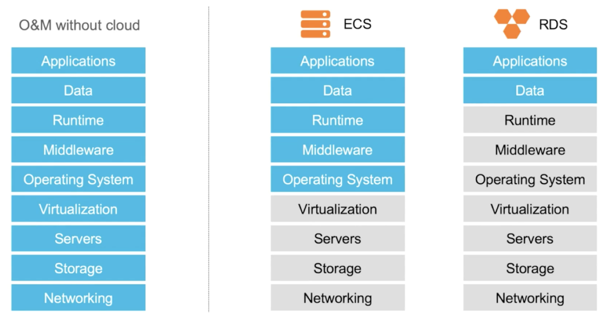
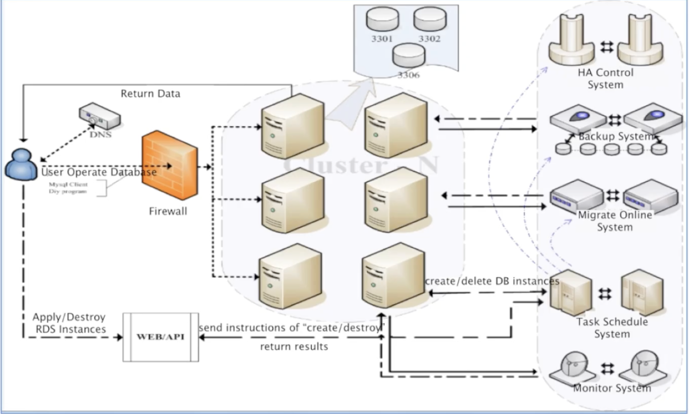
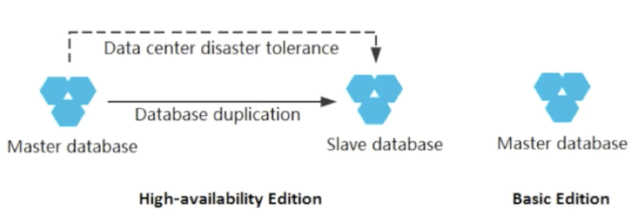
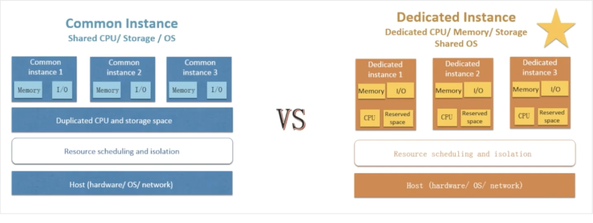

# RDS (Relational Database Service)

## Intro

### Advantages

1. Most DB engines are supported
2. High Availability
3. High Performance
4. Managed Service
5. Easy to scale & operate
6. run as many or few systems

### Fully managed host and OS

1. grab & go, additional operation, monitoring & security tools
2. 99.99% availability (3-node multi AZ deployment)
3. Automatic failover in case primary instances are not available

### Fully managed storage

1. up to 20,000 IOPS and 2TB storage for each instance

### Apsara

1. RDS runs on top of Apsara & depends on distributed file system "Pangu" to run properly.

2. Only need to care about data & application layer

   

### Service Architecture

security services -> RDS (acessible on the common ports) -> H/A control system, Backup systems & Online migration systems & Task Schedulers & Monitoring systems

## RDS instances

1. DB service running on virtual computing environment.
2. User can decide DB engine, CPU, memory, storage and network capabilities
3. Instance types
   - CPU
   - Memory
   - Storage
   - Network

### How to choose?

1. Basic Edition

   - Decoupled storage and compute with **single** computing node
   - High cost effectiveness

2. High Availability edition

   - **1 master node and 1 slave node**
   - SSD storage, good performance

3. Enterprise Edition

   - **Three-node architecture, 1 master node and 2 slave nodes**
   - Strong data consistency through synchronizing multiple log copies
   - Financial-level data reliability and cross-IDC disaster tolerance

4. Cluster Edition (Special Edition)
   - Available for SQL Server 2017 only

### Basic vs High Availability Edition

1. Basic Edition

   - 1 node & no slave node for fault tolerance
   - **Half the price** of HA edition
   - Suitable for :
     1. Micro websites
     2. Dev and Test environemnts for small & medium enterprises

2. High-Availability Edition

   - 2 instances in the same or different zones with automatic data synchronization
   - Automatic failover
   - Suitable for :
     1. Prod DB for large enterprises

3. Enterprise Edition

   - Suitable for financial, securities, insurance industries

### Instance Type

1. Common Instance

   - Very cost effective
   - Storage capacity not linked with CPU, flexible configurations
   - **Downside**: sharing hardware with other users

2. Dedicated Instance
   - Dedicated CPU cores & threads
   - storage space reserved for high stability
   - **resources is guaranteed**

These are shared OS scenarios, you might not be the only tenant in the hardware, but with Dedicated instance you have **guaranteed performance**

## Backup

### Instance Backup File

1. If total backup is below 50% x Purchased instance storage space, **there is no extra charge**

2. Users can obtain temporary links to download their backup data

3. Also suports dumping backup files to OSS for cost efficient offline storage

### Multi region disaster recovery

1. RDS is Regional service, can't migrate from 1 region to another

2. but we can run 2 RDS instances in 2 different region and sync data between them using data transmission service

### Read-Only Instance (currently limited to MySQL)

1. **ApsaraDB for MySQL** allows read-only instances to be directly attached to RDS in order to limit the read pressure on the master instance

2. master & read only instance have independent connection asddress

3. read/write splitting address to automatically balance the requests and perform read/write splitting

4. **Take note:** can't use read-only instances to achieve HA, they can't be promoted to master. **To achieve HA, you need to purchase HA RDS service**

### Ways to extend RDS storage

1.  Memcache, Redis
    - high response speed for cached hot data
2.  OSS
    - take pressure off RDS

## Monitoring and Security

### Security

3 level security defense system to protect DB against security threats

1.  Anti-DDos
2.  IP whitelist
3.  WAF

    - intercepts SQL injection, brute force attack and other forms of DB attack

    - ApsaraDB for RDS provides SQL audits, we can keep track of "who, what, when" of DB access and modification

### RAM (Resource Access Management)

Control who can perform actions on RDS

### Access Control

1. Require IP address to be whitelisted before the clients can access DB. Includes external clitents and ECS clients in the same VPC

2. Allows setting up SSL connections from ECS to RDS via Load Balancers. Allows clients to perform E2E encryption of then connection
