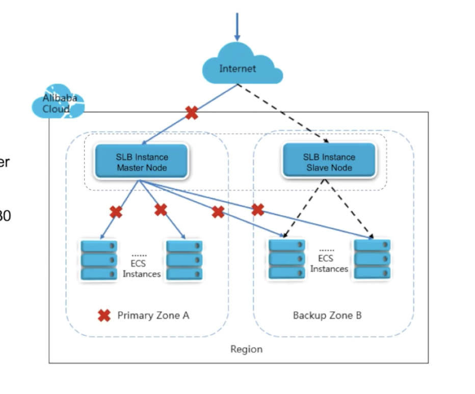
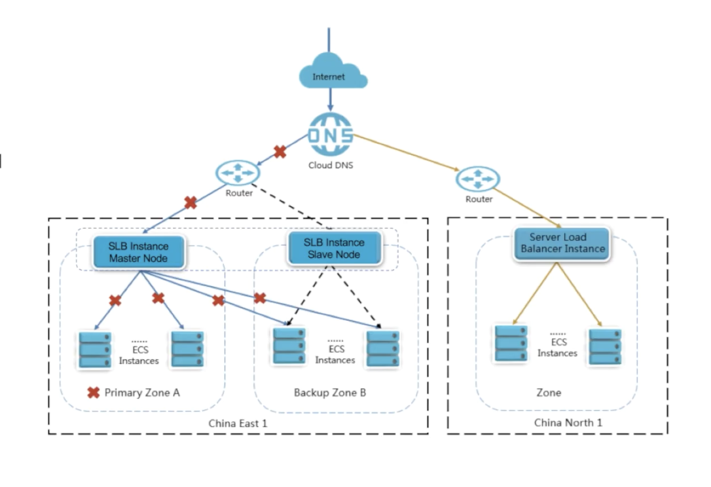

# SLB (Server Load Balancer)

## Introduction

Server Load Balancer (SLB) is a traffic distribution control service that distributes the incoming traffic among multiple ECS instances according to the configured forwarding rules

Features:

1. **High Availability**

   - 99.99% service availability for multi-zone SLB

2. **Scalability**

3. **Low cost**

   - Reduce costs by 60% compared to traditional hardware load balancing systems

4. **Security**

   - Defend against DDoS attacks up to 5Gbps

## Features

### Architectures

1. Layer 4 - Uses Linux Virtual Server (LVS) with `keepalived`

2. Layer 7 - Uses Tengine, a web server project based on NGINX

### Layer 4 (Network)

- TCP & UDP

- Incoming client connection bound to server connection

- No header modification

### Layer 7 (Application)

- Support HTTP and HTTPS

- Connection terminated at the load balancer and pooled to the server

- Headers may be modified

- X-Forwarded-For header contains client's IP

## Components

Server load balancer instance can be created with at least 1 listener and 2 ECS instances configured

1. **Server Load Balancer instances:**

   - receives and distributes incoming traffic to BE servers

2. **Listeners:**

   - waits for client requests and forward the requests to the BE servers.

   - performs health check

   - a load balancer instance can have multiple listeners

### Cost optimization

SLB only supports purchasing in Pay-As-You-Go mode

1. Public Network SLB: Pay As You Go (PAYG)

   - Billed for instance usage and public network traffic

   - Billed for exact volume or resources you actually use (**per hour**)

   - No long-term commitments or upfront payments

2. Private Network SLB: Free

   - helpful when adopting a multi tier architecture

### Instance type

1. Classic network SLB

   - legacy, this is from before alibaba cloud implement VPC

2. VPC network SLB

### Cost Optimization (continued)

### Listeners

- Define the protocol and port on which the load balancer listens for incoming connections

- Each load balancer needs at least one listener to accept incoming traffic

  1. Routing (forwarding) rules

  2. Session stickiness

  3. Health check configurations

  4. Peak bandwidth can be set

### Listeners - Forwarding Rules

3 scheduling algorithms:

1. **Round robin**

   - Distributed sequentially

2. **Weighted round robin (WRR)**

   - Set a weight for each BE server. Servers with higher weights receive more requests than those with lower weights.

3. **Weighted least connections (WLC)**

   - number of sessions is also considered

### Listeners - Limitations

1. Up to **50** listeners can be added to a Server Load Balancer instance.

2. Each listener corresponds to **an application** deployed on ECS instances

### Backend Servers

Limitations: No cross region deployment

### Backend Server Groups

Because the IP address presented by SLB creates a single interface through which backend ECS instances are accessed, multiple ECS instances located in the same region can act as a highly available service pool.

1. **Master-slave server group**

   Requests are distributed to master server when it works normally, when it is down, requests will be distributed to the slave server (only for layer-4 listeners)

2. **VServer group**

   Distribute different requests to different BE servers, or you want to configure domain name and URL forwarding rules, use VServer groups (available only for Layer-7 listeners)

### Health Checks

Health checks allow for traffic to be shifted away from failed instances

1. **HTTP/HTTPS (Layer-7 listener)**

   Verifies network connectivity

   Send an HTTP head request to each ECS server and expect to get back HTTP status code 200

2. **TCP Listeners (Layer-4 listener)**

   Load balancer will send an SYN to ECS and expects SYN + acknowledgement and then it will send an acknowledgement & reset

3. **UDP Listeners (Layer-4 listener)**

   SLB sends UDP probe to back end ECS server and expects to get nothing back

   If it receives ICMP unreachable error message, it is unhealthy

Layer 7 health checks ensure application-level functionality, providing a more comprehensive assessment of service health.

## Additional Settings

### Multi-Zone Disaster Tolerance

utilizes primary/backup zone feature in SLB

- If a primary zone becomes unavailable, SLB rapidly switches to a backup zone to restore its service capabilites within 30s

- when primary zone becomes available, SLB automatically switches back to the primary zone

  

### Cross-region Disaster Tolerance

- You can't achieve this with SLB alone, because it doesn't span multiple regions.

- Need to include DNS failover capability

- Alibaba Cloud DNS has a built in health check

  

- issues:

  - how to synchronize database between 2 region?

  - multi region architecture is more complex

### Auto Scaling

SLB integrates with Auto Scaling to manage the scaling of each listener independently

1. Maintain ECS instance availability

   - Detects impaired ECS instances
   - Replace the instances Automatically

2. Automatically scale your ECS

   - Follow the demand curve for your app
   - Reduce need to manually provisison ECS capacity
   - Automatically bound new ECS instances to the SLB
   - Run at optimal utilization

### Security

- Protection against DDoS attacks up to 5Gbps (Anti-DDoS Basic)

- All traffic from internet must first go through Anti-DDoS Basic and then arrive at SLB

- Anti-DDoS Basic can defend against attacks such as SYN, UDP, ICMP, DNS, NTP, HTTP flood attacks

- service is free for up to 5Gbps, if exceeds consider upgrading to Anti-DDoS probe

Anti-DDoS Basic sets the **cleaning threshold** and **black hole threshold** according to the public network bandwidth configured for SLB

- Cleaning threshold

  - limit set in a load balancer that allows it to direct requests to another server when it reaches cleaning threshold

- Black Hole threshold

  - Stop sending requests to the server, it is a "black hole" (they go in but don't get processed)
